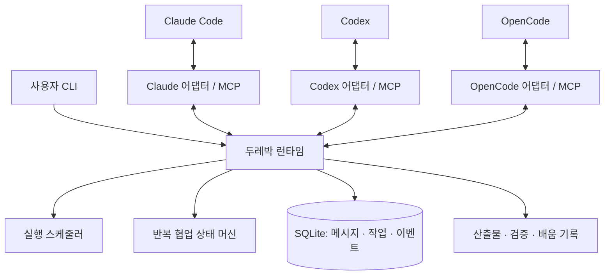

# 두레박 아키텍처 개요

> 구현 상태: cooperative alpha의 실제 지원 범위는 [구현 현황](IMPLEMENTATION.md)을 따른다. 이 문서의 자동 실행·고급 맥락 기능은 목표 설계다.
이 문서는 [제품 스펙](superpowers/specs/2026-09-29-durebak-design.md)의 구조를 요약한다. 인터페이스·기본값·수용 기준의 기준은 제품 스펙이며, cooperative 통신 런타임은 구현되었고 자동 실행 계층은 후속 범위다.

## 구성

사용자당 하나의 로컬 daemon이 workspace별 메시지와 작업을 저장한다. CLI와 여러 MCP bridge가 같은 daemon에 연결한다. Provider 차이는 어댑터가 처리하고 런타임은 공통 상태 계약으로 동작한다.

## 책임 분리

| 계층 | 질문 | 담당 |
|---|---|---|
| 통신 | 누구에게 무엇을 전달할 것인가? | 등록, 우편함, 요청/응답, 이벤트 |
| 실행 | 언제 어떤 세션을 실행할 수 있는가? | capability, 소유권, 대기열, 재연결 |
| 협업 | 어떤 결과가 다음 작업을 여는가? | 작업 의존성, 검토, 수정, 검증 |
| 사용자 통제 | 어디까지 자동으로 해도 되는가? | workspace, 권한, 한도, pause/cancel |

스킬은 협업 절차를 알려 주고, 플러그인은 각 도구에 연결을 설치한다. 저장·스케줄링·복구는 런타임 코드가 수행한다.

## 세션 참여

| 모드 | 의미 | 자동 진행 |
|---|---|---|
| Managed | 두레박이 실행을 관리하는 세션 | 검증된 어댑터 기능으로 제공 |
| Attached | 호스트의 공식 연결로 참여한 기존 세션 | 호스트 capability에 따라 제공 |
| Cooperative | MCP/CLI로 우편함을 읽고 답하는 기존 세션 | 자동 깨우기를 보장하지 않음 |

이미 활성화된 세션을 별도 프로세스가 동시에 재개하지 않는다. 해당 연결의 capability와 실행 소유권을 확인해야 한다.

## 한 번의 요청이 흐르는 과정

1. 세션 A가 B에게 요청을 보내면 런타임이 발신자·workspace 권한을 확인한다.
2. 메시지와 outbox를 함께 저장하고 A에게 request ID를 반환한다.
3. 스케줄러가 B의 실행 가능 상태를 확인해 전달하거나 대기시킨다.
4. B가 읽음·수락·결과를 단계별로 보고한다.
5. 결과의 request ID와 산출물 revision을 확인한다.
6. A가 후속 실행을 기다리고 있다면, A의 이전 턴 종료를 확인한 뒤 이어서 실행한다.

요청은 빠르게 반환하고 실제 기다림은 지속 가능한 상태로 저장한다. 모델 실행 한 개가 상대의 응답을 무기한 도구 호출로 붙잡지 않도록 설계한다.

## 반복 개선의 기준

산출물 → 검토 → 수정 → 새 산출물 → 검증으로 이어진다. 수정은 새로운 revision을 만들고 기존 검토·검증의 유효 범위는 이전 revision에 남긴다. 완료 판단에는 최신 revision에 대한 근거가 필요하다.

라운드 내부 의존성은 DAG다. 수정 라운드는 새 작업 집합으로 표현한다. 정해진 한도, 무진전, 불확실한 실행, 사용자 중단은 새 실행을 멈추게 한다.

## 복구와 전달 보장

메시지는 at-least-once로 전달하고 idempotency key와 처리 기록으로 중복을 억제한다. 외부 도구 부작용의 exactly-once는 보장하지 않는다. 모델 입력 후 연결이 끊긴 경우 상태를 확인하기 전 자동으로 다시 실행하지 않는다.

제안 구현 기술은 TypeScript, 지원 Node.js LTS, SQLite WAL, 인증된 loopback HTTP/JSON + SSE, MCP stdio bridge다. 런타임과 SDK 버전은 실제 Provider 시험으로 고정한다.

## v0.3.0 보충: 실행 backend와 복구 경계

Provider와 backend는 별개다. native SDK/API와 acpx/ACP 경로를 같은 어댑터 계약으로 평가한다. 두레박이 정책과 대기열의 기준을 소유하고 backend에는 활성 입력 한 개만 제출한다. 같은 Provider 세션을 두 backend가 동시에 소유하지 못하게 한다.

세션 identity는 host·Provider instance·Provider session ID의 조합이다. 경로·포트·PID·표시 이름만으로 identity를 판단하지 않는다. task claim은 원자적 상태 변경이며 lease 만료가 실제 프로세스 종료를 증명하지 않는다.

이벤트는 live, history replay, native audit를 구분한다. 재생과 감사는 새 요청을 만들지 않는다. checkpoint는 상태 복원에 사용하고 장기 learning은 채택된 배움 재사용에 사용한다. 모델·도구 실행 부작용은 operation receipt로 추적한다.

완료 판정에는 artifact revision뿐 아니라 policy digest도 일치해야 한다. 취소는 논리적 상태와 실제 정지 확인을 구분하며, 결과 요약에는 기준별 근거·unknown 비용·남은 실행을 표시한다.

선정 근거와 아직 검증하지 않은 부분은 [조사 보고서](RESEARCH.md)에 정리했다.

## v0.4.0 보충: 맥락·캐시·기록

런타임의 context assembler는 역할·정책·수신자의 context epoch에 맞춰 bounded bundle과 원문 참조를 만든다. 파생 자료는 workspace와 내용 hash로 캐시하고, Provider prompt cache는 어댑터 capability와 실제 usage로 관측한다. 두 캐시를 같은 것으로 집계하지 않는다.

record renderer는 DB/checkpoint에서 Markdown을 결정적으로 만들고 관련 기록을 색인한다. 자동 렌더링은 모델을 호출하지 않는다. 영속 원본·재사용 learning·삭제 가능한 파생 cache의 수명을 분리한다. 프로젝트 공개 문서로 export는 명시적 작업이다.

[상세 계약](CONTEXT-CACHE-RECORDS.md)은 변경분 전달, compaction 후 base 갱신, usage 정규화, cache 무효화와 원본 근거 보존을 정의한다.

## 코드 유지보수 경계

외부 CLI·HTTP·MCP 계약과 DB schema 3은 유지한다. `Store`는 기존 API를 제공하는 조합 계층이며, 다음 모듈에 기반 기능을 위임한다.

| 파일 | 책임 | 변경 시 검증 |
|---|---|---|
| src/domain.ts | 공통 타입, 입력 schema, 오류와 hash | 입력·권한·idempotency 회귀 |
| src/database.ts | 비공개 디렉터리·DB 열기·초기화 실패 시 닫기 | 런타임 시작·복구 |
| src/migrations.ts | 기존 DB의 순차 이관 | schema 1·2 이관 및 재시작 |
| src/transactions.ts | BEGIN IMMEDIATE·commit·rollback | claim 경쟁·ack 만료 경계 |
| src/queue-policy.ts | 우선순위, 대기 한도, 재시도 계산 | 가상 시간 큐 테스트 |
| src/content.ts | UTF-8 범위·JSON 크기 제한 | HTTP 특수문자·캐시 페이지 |
| src/store.ts | 세션·메시지·작업·산출물의 트랜잭션 조합 | 전체 저장소·HTTP·MCP 통합 |

의존성은 Store → DB/정책/본문 처리 → 공통 계약 방향이다. 공통 오류만 필요한 client·records는 Store를 가져오지 않는다. 기존 Store export는 호환성을 위해 유지한다. 정책 시간·횟수를 변경할 때는 queue-policy.ts의 상수를 기준으로 변경하고, 동일 숫자를 메시지 처리 코드에 복사하지 않는다.

마이그레이션은 이미 배포한 SQL의 의미를 바꾸지 않고 새 버전을 추가한다. 메시지 수신과 감사 기록, 만료 판정과 ack는 각기 같은 트랜잭션을 유지한다. 하위 함수에서 중첩 트랜잭션을 열지 않는다. 순수 구조 변경에는 기존 회귀 테스트를 사용하고, 새 동작에는 재현 테스트를 추가한다.

## 이종 도구 연결 보충 설계

[2026-09-30 어댑터 제안](superpowers/specs/2026-09-30-heterogeneous-adapters-design.md)은 기존 Provider 용어를 harness(실행 도구), backend(연결 방식), modelProvider/model(추론 서비스·모델)로 구분한다. [Orca·Herdr·Herd·ACP 비교](HETEROGENEOUS-AGENTS.md)를 근거로 공통 정책과 도구별 실행을 분리한다. 제안 상태이며 현재 코드·API가 변경됐다는 뜻은 아니다.

구조 결정의 이유와 비용은 [ADR 목록](adr/README.md)에, 단계별 구현 순서는 [이종 어댑터 구현 계획](superpowers/plans/2026-09-30-heterogeneous-adapters.md)에 기록한다. 공개 자료는 [공개 파일 정책](PUBLICATION-POLICY.md)을 따른다.
