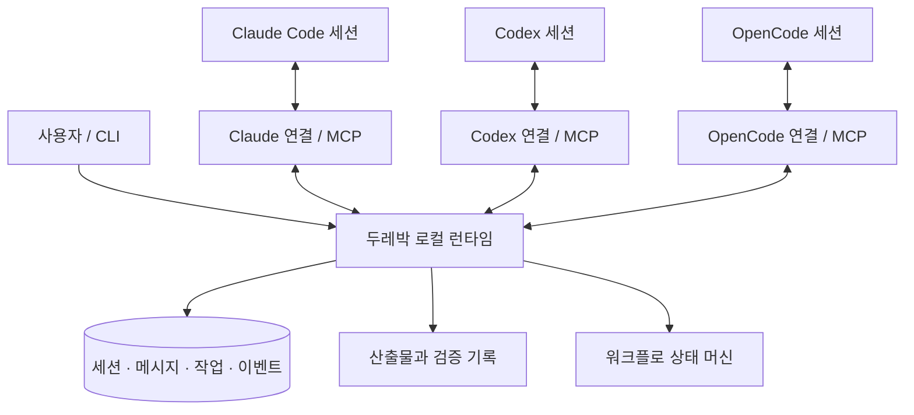
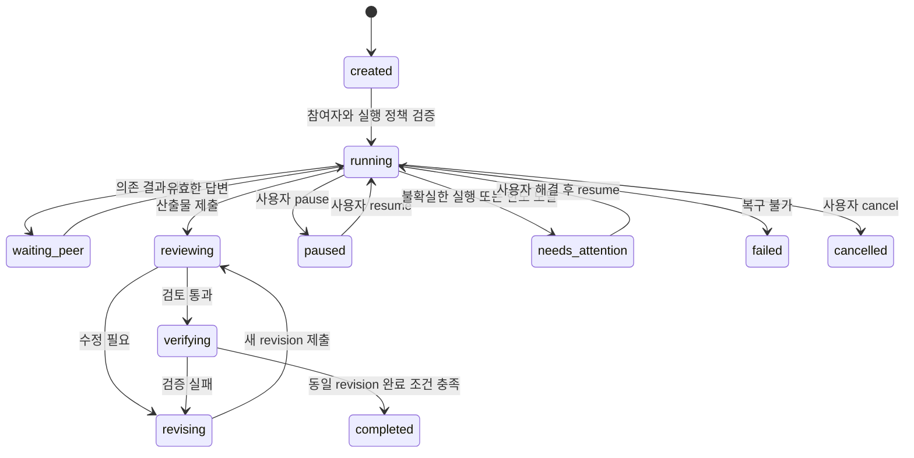

# 두레박 — 세션 간 협업·오케스트레이션 제품 스펙

> 2026-09-29: Cooperative alpha 구현 범위는 [구현 현황](../../IMPLEMENTATION.md)을 따른다. 전체 수용 기준 완료를 뜻하지 않는다. 라이선스는 Apache-2.0으로 확정했다.
- 문서 버전: 0.4.0
- 개정: 토큰 예산, 계층별 캐시, 기록·문서 생성, 재사용 무효화와 비용·품질 평가 계약 보충.
- 작성일: 2026-09-29
- 상태: 검토용 설계 초안. 구현·호환성 검증·공개 배포 이전.
- 제품명: **두레박**
- 영문 브랜드: **Durebak**. CLI·설정 디렉터리 식별자: **durebak**, **.durebak**. GitHub 조직·npm 패키지·도메인의 확보 여부는 별도로 확인한다.
- 대상: Claude Code, Codex, OpenCode 등 서로 다른 실행 도구의 에이전트 세션.

## 1. 의도와 성공 정의

두레박은 각각의 맥락을 유지하는 에이전트 세션들이 서로 발견하고, 질문하고, 일을 요청하고, 결과를 돌려주고, 피드백을 반영하며 공동 목표를 달성하게 하는 공개 배포형 협업 런타임이다.

사용자가 명시한 요구사항:

1. 서로 다른 세션 간 양방향 소통이 가능해야 한다.
2. Claude·Codex·OpenCode가 함께 오케스트레이션에 참여해야 한다.
3. 메시지뿐 아니라 결과를 주고받고, 계속 개선·발전시키는 작업 흐름을 지원해야 한다.
4. GitHub 등에서 다른 사람이 받아 설치하고 사용할 수 있어야 한다.
5. 제품의 한국어 이름은 두레박이다.
6. 첫 공개 버전은 같은 컴퓨터의 여러 세션을 연결한다. 사용자 확인 완료.

설계 기본값으로 제안하는 가정:

- 원격 호스트 연결은 후속 범위다.
- 사용자는 기존 도구의 인증을 유지한다. 두레박이 모델 계정·API 자격증명을 통합 보관하지 않는다.
- 기존 세션 참여와 두레박이 실행하는 세션을 모두 제품 모델에 포함한다. 자동화 가능 수준은 구분해 표시한다.
- 반복 개선은 산출물과 협업 절차를 개선하는 것이다. 모델 가중치 학습이나 실행 중인 두레박의 무승인 자기 업데이트를 의미하지 않는다.

**대표 성공 시나리오:** 사용자가 목표와 완료 기준을 정한다. OpenCode가 작업하고 Claude Code가 결과를 검토하며 Codex가 검증한다. 문제를 발견하면 원래 작업 세션이 맥락을 유지하여 수정한다. 동일 산출물 버전에 대한 검토·검증이 충족되면 종료한다. 사용자는 전체 대화, 변경, 판단 근거를 추적할 수 있다. 시작 역할은 고정하지 않으며 세 도구 간 역할을 바꾸어도 성립해야 한다.

### 1.1 두레박의 제품 컨셉

**각자의 깊이를 길어, 함께 더 나은 결과로.**

각 세션은 고유한 맥락과 도구를 가진다. 두레박은 필요한 질문과 결과를 상대 세션까지 전달하고, 피드백을 원래 작업으로 되돌려 개선이 이어지게 한다. 결과물과 검증 근거를 버전별로 남기고, 채택된 배움은 다음 협업에 활용한다.

브랜드 비유는 소개에 사용하고 공개 API에서는 session, message, task, artifact, workflow처럼 기능을 설명하는 용어를 쓴다. 자동화는 사용자가 정한 범위와 완료 기준 안에서 이어지며, 특정 Provider가 영구 지휘자가 될 필요는 없다.

브랜드 기준은 [제품 컨셉](../../CONCEPT.md), 문서 진입점은 [README](../../../README.md)에 정리한다.

## 2. 용어와 경계

| 용어 | 정의 |
|---|---|
| Provider | Claude Code·Codex·OpenCode와 같은 실행 도구. 모델명과 별개다. |
| Session | 도구 고유 세션 ID와 연결된 두레박의 영속적인 참여 단위. |
| Binding | 특정 세션과 현재 프로세스·어댑터 연결 사이의 수명 제한 연결 정보. |
| Workspace | 소통과 파일 접근을 허용한 프로젝트 범위. worktree들이 같은 workspace에 속할 수 있다. |
| Conversation | 특정 주제에 대한 두레박 메시지 스레드. Provider의 대화 세션과 구분한다. |
| Message | 발신자·수신자·원인·본문이 기록되는 통신 단위. |
| Task | 담당자, 의존성, 완료 기준을 갖는 작업 단위. |
| Workflow run | 여러 작업과 개선 라운드를 관리하는 실행 인스턴스. |
| Attempt | 작업 실행 시도. 재시도마다 새로운 ID를 갖는다. |
| Artifact revision | 코드, 문서, 보고서 등 결과의 변경 불가능한 특정 버전. |
| Evidence | 특정 결과 버전을 대상으로 수행한 검증의 명령·환경·결과 기록. |

모델 교체는 Provider 교체와 다르다. OpenCode에서 Claude 모델을 쓰는 것과 Claude Code 세션에 메시지를 보내는 것을 동일하게 취급하지 않는다.

v0.1 비목표: 일반 ChatGPT/Claude 웹 채팅 UI 자동조작, 임의의 실행 세션 강제 탈취, 계정 공유, SaaS 멀티테넌시, 인터넷 공개 서버, 무제한 자율 실행, 대형 작업 계획을 자동 생성하는 별도 AI 플래너, 자동 PR 병합·배포.

## 3. 접근 방식 비교와 결정

| 방식 | 장점 | 한계 | 결정 |
|---|---|---|---|
| 스킬 + 공유 파일/CLI | 작은 실험이 쉽고 다양한 도구가 호출 가능 | 깨우기·동시성·복구·전달 상태가 불명확해지기 쉬움 | 수동 참여용 인터페이스로 활용 |
| 공통 런타임 + MCP/CLI + Provider 어댑터 | 메시지와 실행 상태를 통제하고 복구·확장 가능 | 런타임과 어댑터를 유지해야 함 | **기본 구조** |
| 기존 메시징 프로젝트 확장 | 우편함 등 일부 기능 재사용 가능 | 실행 제어·상태 모델·배포·라이선스 적합성 확인 필요 | 재사용 조사 대상으로 유지 |

MCP Agent Mail은 등록·메시징·우편함·확인·파일 예약의 참고 구현이다. v0.1 필수 의존성으로 확정하지 않는다. 재사용하더라도 두레박의 상태·권한·복구·호환성 계약을 충족해야 한다.[S6]

선택한 구조에서 스킬은 협업 지침, 플러그인은 배포 포장과 호스트 연결, MCP는 에이전트가 호출하는 도구 표면이다. 실제 전달과 지속 실행은 런타임 및 어댑터가 담당한다. 단순 MCP 알림 수신을 모델 실행이나 메시지 읽음으로 간주하지 않는다.

### 3.1 유사 도구 조사와 재사용 판단

[조사 보고서](../../RESEARCH.md)에 7개 유사 도구와 ACP·MCP Tasks·A2A·LangGraph 문서를 비교했다. 기능 중복이 있으므로 모든 계층을 직접 구현하는 것을 전제로 하지 않는다.

- acpx/ACP는 상태 유지 세션과 실행 대기열을 제공하는 **실행 backend 검증 후보**다. 직접 Provider API 경로와 동일한 계약 시험으로 비교한다.[S9]
- Agent Relay의 실행 규칙과 두 Agent Mail의 전달·감사 분리를 참고한다. 외부 메시지 저장소를 v0.1 필수 의존성으로 추가하지 않는다.[S6][S10][S11]
- Beads의 원자적 작업 claim, Relay의 검증 루프, Claude Teams의 복구 제약을 바탕으로 아래 상태 계약을 보충한다.[S12][S13][S14]
- 표준 지원은 기능 협상으로 확인한다. MCP Tasks와 A2A 연결은 후속이며 ACP backend 평가만 첫 호환성 검증 범위에 추가한다.

조사는 문서 확인 수준이다. 코드 재사용 결정 전 버전 고정, 실제 시험, LICENSE·NOTICE·전이 의존성 검토가 필요하다.

## 4. 구조와 책임



| 구성 | 책임 | 의존 경계 |
|---|---|---|
| Protocol | 요청·응답·이벤트·오류·호환성 스키마 | Provider 독립 |
| Runtime | 인증, 세션 등록, 우편함, 저장, 이벤트 재생 | Protocol + 저장소 |
| Scheduler | 실행 대기열, 실행 소유권, 재시도, 한도 적용 | Runtime + 어댑터 인터페이스 |
| Workflow engine | 작업 의존성, 검토·수정 반복, 완료 조건 | Runtime의 공개 서비스 계약 |
| Provider adapter | 세션 발견·실행·재개·중단·이벤트 변환 | 해당 Provider API/SDK |
| MCP bridge | 공통 협업 기능을 도구로 제공 | Runtime API |
| CLI | 설정, 진단, 사용자 통제, JSON 출력 | Runtime API |
| Skills/plugins | 사용 절차와 도구별 설치 설정 | MCP/CLI 공개 표면 |

제안 기술 기본값: TypeScript, 릴리스 시 고정한 지원 Node.js LTS, SQLite WAL, 로컬 파일 기반 산출물 저장. 정확한 런타임·SDK 최소 버전은 실연동 시험 후 호환성 manifest로 고정한다. 현재 공식 문서만 보고 설치 가능한 최소 버전을 선언하지 않는다.

v0.1은 사용자당 하나의 daemon과 로컬 저장소를 사용하고 workspace를 논리적으로 분리한다. MCP stdio 프로세스 여러 개가 동일 daemon에 연결한다. 브리지마다 별도 메시지 저장소나 스케줄러를 만들지 않는다.

CLI·어댑터와 daemon은 인증된 loopback HTTP/JSON 및 SSE로 통신한다. daemon은 OS가 배정한 포트와 인스턴스 ID를 사용자 전용 권한의 endpoint 파일에 기록한다. v0.1에서는 비-loopback 바인딩을 거절한다. HTTP 요청의 Origin/Host 검증과 토큰 인증을 적용하며 토큰을 URL에 넣지 않는다. MCP stdio는 호스트에서 시작한 브리지를 사용한다.

### 4.1 실행 backend 계약과 단일 소유자

Provider와 실행 backend를 구분한다. 예를 들어 Provider가 codex여도 backend는 native App Server 또는 검증된 ACP client일 수 있다. 런타임의 어댑터 계약은 `probe`, `start`, `resume`, `submit`, `observe`, `cancel`, `reconcile`, `close`를 포함한다. 반환값에는 backend run/turn ID와 capability가 필요하다. 지원하지 않는 연산은 명시적 오류다.

두레박이 workflow 정책과 입력 대기열의 기준을 소유한다. backend가 자체 queue owner를 가진 경우 binding별로 그 소유자에 연결하고, 두레박은 활성 입력 한 개만 제출한다. 뒤쪽 입력은 두레박에 남긴다. 두 backend가 같은 Provider 세션을 동시에 제어하는 구성을 거절한다.

backend 설정·버전·MCP 도구 목록의 digest를 binding에 저장한다. 변경은 idle 확인 후 새 binding으로 반영한다. 실패했다고 backend나 모델을 조용히 바꾸거나 새 세션을 기존 세션인 것처럼 표시하지 않는다. 대체 세션은 사용자 정책이 허용할 때 새 ID와 `continuation_of` 관계로 생성한다. 자동 대체 기본값은 off다.

## 5. 세션 참여와 기능 협상

### 5.1 세 가지 참여 모드

| 모드 | 세션 소유자 | 소통 | 자동 후속 실행 |
|---|---|---|---|
| Managed | 두레박 실행 어댑터 | 우편함 + 어댑터 전달 | 검증된 start/resume 기능으로 가능 |
| Attached | 사용자 도구의 기존 세션 | 플러그인·이벤트 연결 | 호스트가 제공하는 push/실행 기능 범위 내 |
| Cooperative | 사용자의 기존 세션 | MCP/CLI로 직접 읽고 답변 | 보장하지 않음. 사용자가 진행하거나 세션이 확인해야 함 |

세션 ID를 안다는 이유만으로 다른 프로세스가 그 세션을 동시에 resume하지 않는다. Attached 모드는 host가 확인한 연결에만 사용한다. 연결 수단이 없으면 Cooperative로 표시하며 성공한 척하지 않는다. 실행 중인 터미널에 문자열과 Enter를 주입하는 방식은 v0.1 기본 경로에서 제외한다.

### 5.2 Capability 계약

등록 응답은 최소한 다음 정보를 반환한다.

```json
{
  "session_id": "ses_01",
  "provider": "codex",
  "mode": "managed",
  "capabilities": {
    "mailbox": true,
    "start_turn": true,
    "resume": true,
    "push_idle": true,
    "steer_active": false,
    "interrupt": true,
    "usage_reporting": "partial"
  },
  "execution": "idle",
  "connectivity": "connected"
}
```

위 값은 예시이며 특정 도구의 실제 보장값이 아니다. Capability는 Provider 버전, 어댑터 버전, 실행 모드, 연결 상태, 설정의 교집합으로 결정한다. 사용 가능·사용 불가와 그 이유를 `doctor`에서 확인할 수 있어야 한다.

실행 상태와 연결 상태를 분리한다.

- execution: `idle | running | waiting_peer | waiting_user | stopping | unknown`
- connectivity: `connected | stale | offline`
- heartbeats 기본 10초, 마지막 확인 후 30초에 stale, 60초에 offline.
- heartbeat 끊김은 모델 작업의 종료를 증명하지 않는다. 재연결 전에는 unknown 상태로 중복 실행을 차단한다.

### 5.3 Provider별 검증 대상

| Provider | 첫 구현 경로 | 기존 세션 연결 | 검증할 사항 |
|---|---|---|---|
| OpenCode | Server API의 세션 요청과 이벤트 | 플러그인 및 연결된 서버 세션 | 실행 중 요청 처리, 완료 이벤트, 승인 대기, 서버 재연결 |
| Claude Code | Agent SDK 또는 구조화된 headless 실행 | MCP Cooperative; Channels는 선택 실험 경로 | resume 소유권, 결과 이벤트, 채널 사용 조건과 버전 |
| Codex | App Server thread/turn API | MCP Cooperative; 별도 호스트 연결은 후속 검증 | start/resume, active turn, 승인, 중단 및 복구 |

OpenCode는 비동기 세션 입력 API를, Claude SDK는 세션 재개를, Codex App Server는 턴 시작·진행 중 입력·중단을 문서화한다.[S1][S3][S4] 이것만으로 독립 실행 중인 모든 UI 세션 제어가 보장되지는 않는다.

추가 조사에서 Claude Code Channels는 실행 중 세션에 이벤트를 전달하는 공식 경로로 확인했다. 연구 프리뷰이며 인증·조직 설정·플러그인 허용 등 조건이 있으므로 v0.1 필수 경로로 두지 않는다.[S5]

### 5.4 영속 identity와 연결 수명

Provider 세션의 실질 식별자는 `(host_id, provider, provider_instance_id, provider_session_id)`다. endpoint 포트와 PID는 재시작·재사용될 수 있으므로 identity로 사용하지 않는다. 사람이 붙인 session alias는 workspace 안에서 유일해야 하며 충돌 시 명시적으로 다시 이름을 정한다.

두레박 session ID는 위 식별자에 영속적으로 매핑된다. binding ID는 실행 연결이 바뀔 때 갱신한다. host ID는 로컬 생성 ID이고 장치의 민감한 하드웨어 식별자를 사용하지 않는다. provider_instance_id는 사용자 등록 instance이며 포트 변경만으로 다른 세션을 만들지 않는다.

workspace ID는 절대 경로와 분리된 생성 ID다. 경로 이동과 worktree 연결은 명시적 매핑 변경으로 처리하며 Git remote URL만 같다고 자동 합치지 않는다. 같은 Provider 세션의 중복 등록은 기존 mapping으로 수렴하거나 권한 충돌로 거절한다. provider 원본 ID를 확인할 수 없는 Cooperative host에서는 제한된 등록 ID를 발급하고 `identity_verified=false`로 표시하며 Managed takeover를 허용하지 않는다.

## 6. 기능 요구사항

| ID | 요구사항 | 우선순위 |
|---|---|---|
| FR-01 | 세션 등록·해제·재연결 및 workspace별 목록 | 필수 |
| FR-02 | 동일 Provider 및 서로 다른 Provider 세션 간 요청·응답 | 필수 |
| FR-03 | 수신자별 영속 우편함, 읽음, 요청 수락, 처리 결과 구분 | 필수 |
| FR-04 | conversation와 reply_to에 의한 대화 추적 | 필수 |
| FR-05 | 작업 배정·수락·의존성·기한·실패·취소 | 필수 |
| FR-06 | 구조화된 결과·파일·패치·검증 근거 교환 | 필수 |
| FR-07 | 검토 → 수정 → 재검증의 제한된 자동 반복 | 필수 |
| FR-08 | 지원 모드의 후속 실행과 비지원 모드의 명시적 대기 | 필수 |
| FR-09 | crash/reconnect 후 메시지·작업 상태 복구 | 필수 |
| FR-10 | 사용자 중단·일시정지·재개·담당 변경 | 필수 |
| FR-11 | 세 도구 설치 설정, 제거, 버전 진단, GitHub 배포 문서 | 필수 |
| FR-12 | 협업 기록과 채택된 개선 지식의 재사용 | 기본형 필수 |
| FR-13 | 읽기 전용 다중 수신자 검토와 결과 취합 | v0.1 안정화 이후 |
| FR-14 | 원격 호스트·팀 권한·A2A 연동 | 후속 |
| FR-15 | 복합 세션 identity와 binding별 실행 backend 소유권 | 필수 |
| FR-16 | history replay·native 감사·실시간 메시지의 구분과 중복 방지 | 필수 |
| FR-17 | 원자적 작업 claim과 늦은 결과의 격리 | 필수 |
| FR-18 | rate limit·인증·승인·연결 단절의 구분 및 복구 | 필수 |
| FR-19 | 정책 digest·checkpoint·맥락 묶음에 의한 재개 | 필수 |
| FR-20 | 근거가 연결된 결과 요약과 반복 개선 평가 | 필수 |
| FR-21 | 역할별 맥락 예산, 변경분 전달, 원문 범위 조회 | 필수 |
| FR-22 | 접근 범위·내용 hash 기반 로컬 캐시와 무효화 | 필수 |
| FR-23 | 결정적 문서 생성, 결정·learning 색인, 명시적 export | 필수 |
| FR-24 | 실제/추정/미제공 사용량과 cache 비용 구분 | 필수 |
| FR-25 | 기록 보존·삭제·캐시 eviction 및 품질 회귀 검증 | 필수 |

브로드캐스트로 응답 루프가 확산되는 것을 막기 위해 v0.1의 실행 요청 수신자는 하나다. 여러 검토자에게 요청할 때는 독립된 자식 작업과 correlation ID를 생성한다.

## 7. 공통 메시지 규약

### 7.1 메시지 envelope

```json
{
  "protocol_version": "1.0",
  "message_id": "msg_01",
  "workspace_id": "ws_01",
  "conversation_id": "conv_01",
  "workflow_run_id": "run_01",
  "task_id": "task_02",
  "attempt_id": "attempt_01",
  "from_session_id": "ses_author",
  "to_session_id": "ses_reviewer",
  "kind": "review_request",
  "correlation_id": "req_01",
  "reply_to": null,
  "idempotency_key": "review-revision-3",
  "created_at": "2026-09-29T00:00:00Z",
  "expires_at": "2026-09-29T00:10:00Z",
  "payload": {
    "summary": "요구사항 충족 여부와 회귀 위험을 검토해 주세요.",
    "artifact_revision_ids": ["artrev_03"],
    "acceptance_criteria_ids": ["ac_01", "ac_02"]
  }
}
```

종류: `note`, `question`, `answer`, `task_request`, `task_accept`, `task_reject`, `progress`, `result`, `review_request`, `review_result`, `revision_request`, `cancel`, `error`. 시스템 상태 변화는 별도 Event로 기록한다. ack 자체를 새 모델 요청으로 전달하지 않는다.

서버가 message ID·시간·인증된 발신자·workspace 권한을 결정한다. 클라이언트가 임의의 발신자를 사칭할 수 없다. workflow/task/attempt는 일반 대화에서 null 가능하지만 작업 결과에는 필수다. payload는 kind별 JSON Schema로 검증한다.

텍스트 본문 한도 64 KiB, 산출물 단일 파일 기본 한도 20 MiB. 더 큰 데이터는 명시적으로 등록한 산출물 참조로 교환한다. 원본 대화 전체, 비공개 추론, 환경변수·자격증명은 자동 전달하지 않는다.

### 7.2 전달과 처리 의미

전달 상태: `queued → dispatched → received`, 또는 `expired | cancelled | dead_letter`. `dispatched`는 어댑터/호스트가 받았다는 뜻이고 `received`는 대상 세션의 도구 호출이나 명시적 ack로 읽음이 확인됐다는 뜻이다.

요청 처리 상태: `pending → accepted → completed`, 또는 `rejected | failed | cancelled | timed_out`. 메시지 읽음·전송 성공·HTTP 204는 작업 완료가 아니다. terminal 상태를 늦은 응답으로 되돌리지 않는다.

- 전달은 **at-least-once**, 중복 방지는 idempotency key와 수신 측 message ID 기록으로 수행한다.
- 동일 발신자와 workspace 내 같은 idempotency key 및 동일 내용은 기존 응답을 반환한다. 다른 내용이면 `IDEMPOTENCY_CONFLICT`다.
- 실행 소유권과 중복 억제로 재실행을 최소화하지만, 외부 도구 부작용의 exactly-once는 약속하지 않는다.
- workspace 내 서버 sequence를 부여한다. 수신 세션의 대기열은 기본 FIFO이며 cancel은 실행 제어 우선순위를 갖는다.
- 요청 회신은 correlation ID와 reply_to로 연결한다. 다른 요청에 대한 답변을 대기 해제에 사용하지 않는다.
- 기한 이후 답변은 기록하되 작업을 자동 재개하지 않는다. `late=true`로 사용자에게 노출한다.

메시지 commit과 발송 대기열 생성은 같은 SQLite 트랜잭션으로 수행한다. 어댑터 장애 후 미확인 전달만 재처리한다. 전송 재시도는 1·2·4·8·16초의 지연에 jitter를 추가하고, 최초 시도 이후 최대 5회 또는 expires_at까지다. 정상 offline 대기는 전송 실패 횟수에 포함하지 않는다. 소진된 전달은 dead_letter로 이동한다.

모델 입력을 전달한 뒤 확인 전에 연결이 끊어지면 `delivery_outcome=unknown`을 기록하고 Provider 상태를 조회한다. 이는 별도 전송 결과 필드이며 메시지 lifecycle 상태와 구분한다. 조회로 해소할 수 없다면 자동 재실행하지 않고 `needs_attention`으로 전환한다.

### 7.3 출처·history replay·native 감사

어댑터 입력 이벤트에는 `origin`, `provider_event_id`(지원 시), `binding_id`, `provider_turn_id`, `replayed`, `observed_at`을 포함한다. origin은 `durebak | provider_live | provider_history | native_audit`다. 브리지는 원본 event ID를 보존하고 `(provider instance, native event ID)`로 중복을 억제한다.

ACP session/load처럼 과거 conversation을 재생하는 동작은 resume barrier가 완료되기 전 history로 처리한다.[S15] 과거 결과는 원래 attempt 복구 확인에만 사용한다. 새 요청·새 claim·새 후속 턴을 생성하지 않는다. 어댑터가 replay/live를 안전하게 구분하지 못하면 자동 재개 기능을 비활성화한다.

native 메시지 감사는 기본 off다. 켠 경우에도 `native_audit`는 기록용이며 두레박 우편함으로 다시 전달하지 않는다. Provider native 메시지와 두레박의 같은 대화를 양방향으로 자동 복제하지 않는다. 원본 ID가 없는 이벤트는 임의 텍스트 hash만으로 서로 다른 메시지를 합치지 않으며, 불확실한 live 실행 결과는 중복 실행 대신 확인 대상으로 둔다.

## 8. 실행·대기·교착 방지

각 세션에 동시에 하나의 실행 소유자만 허용한다. 소유권은 lease와 증가하는 fencing token으로 관리하며, 오래된 연결이 보내는 상태 변경은 거절한다. 실행 중 새 입력은 기본적으로 대기열에 보관한다. 명시적으로 지원·허용된 경우에만 active steering을 사용한다.

`ask`는 request ID를 즉시 반환한다. 자동 워크플로에서는 `await_peer`가 대기 의도를 등록하고 현재 모델 턴을 종료할 수 있게 한다. 실제 후속 실행은 턴 종료 이벤트를 확인한 뒤 스케줄러가 수행한다. 응답이 먼저 와도 종료 확인 전 새 턴을 시작하지 않는다.

MCP 요청 하나를 무기한 열어 두지 않는다. `events.wait`의 최대 대기시간은 30초이며 timeout과 cursor를 반환한다. Cooperative 모드의 도구 대기는 우편함 확인에 해당하며 영구 실행 보장이 없다.

요청 의존 그래프에서 A가 B를 기다리는 중 B가 A의 새 실행을 기다리려 하면 `DEPENDENCY_CYCLE`을 반환하고 workflow를 needs_attention으로 전환한다. 이미 등록된 질문에 답하는 것은 새 실행 의존성을 생성하지 않는다.

사용자 pause는 새 실행 배정을 중단하고, 현재 턴은 기본적으로 종료까지 허용한다. cancel은 대기 작업을 취소하고 지원되는 활성 실행에 중단을 요청한다. 중단 요청과 중단 확인을 구분하며, 이미 발생한 파일 변경이나 외부 부작용을 자동으로 되돌리지 않는다.

### 8.1 작업 claim과 실행 lease

작업 상태는 `ready | claimed | running | blocked | succeeded | failed | cancelled`다. 의존성 미충족이면 blocked이고 `dependency` 사유를 갖는다. 작업 수락은 `expected_version`을 포함하는 compare-and-swap으로 ready→claimed를 전환하며 동시에 한 담당자만 성공한다. `TASK_ALREADY_CLAIMED`는 재시도로 강제 탈취하지 않는다.

기본 작업 lease는 30초, 갱신 주기는 10초다. task lease와 세션 실행 lease는 각각의 소유권을 나타낸다. 단일 SQLite 트랜잭션에서 작업 상태·담당자·claim 이벤트를 반영하고 실행 시 attempt ID와 fencing token을 바인딩한다.

lease 만료만으로 이전 프로세스의 종료를 가정하지 않는다. 실행을 reconcile하고 종료/미시작이 확인돼야 ready로 돌리거나 담당을 변경한다. 확인 불가면 blocked와 `execution_unknown`으로 둔다. 오래된 attempt 결과는 감사 기록에 남기되 현재 작업 완료로 채택하지 않는다. fencing은 OS 파일 쓰기를 막지 못하므로 원래 프로세스 정지나 worktree 격리 없이 동일 파일 쓰기를 재배정하지 않는다.

종료된 작업은 되살리지 않는다. 수정·후속 요청은 `parent_task_id`, `supersedes_task_id`, `round`를 가진 새 작업을 생성한다.[S16] task succeeded는 산출물 제출 성공이며 workflow completed와 구분한다.

### 8.2 차단 사유·rate limit·sleep 복구

blocked/needs_attention에는 `reason_code`, `retryable`, `retry_after`, `required_actor`, `last_confirmed_turn_id`를 기록한다. 최소 사유는 dependency, peer_offline, approval_required, auth_required, rate_limited, execution_unknown, no_progress, deadline_exceeded, budget_exceeded, context_unavailable, storage_full이다.

rate limit는 어댑터가 명시적으로 판별한 경우만 자동 재시도 후보로 삼는다. retry-after가 있고 입력이 실행되지 않았거나 앞선 턴이 종료됐다는 근거가 있을 때 동일 작업의 새 attempt로 최대 2회 재시도한다. 전체 deadline·턴 한도는 유지한다. retry-after가 없으면 자동 반복 없이 needs_attention으로 둔다. 전송 재시도와 모델 실행 재시도 카운터는 별개다.

인증·승인 필요는 waiting_user/needs_attention으로 표시하고 일반 메시지가 도착했다고 우회하지 않는다. 연결 단절·절전 복귀 시 먼저 Provider 상태를 확인하고 wall-clock deadline을 검사한다. 만료된 workflow는 밀린 턴을 시작하지 않는다. 중단 중 도착한 답변은 보관하되 pause/cancel 정책을 우선한다.

### 8.3 취소와 실제 실행 정지

논리적 작업 취소와 프로세스 정지는 분리한다. `stop_status=requested | confirmed | unsupported | unknown`과 잔여 실행을 결과에 표시한다. 취소 후 도착한 결과는 늦은 결과로 보관하고 workflow를 되살리지 않는다. 실제 정지가 확인되지 않은 프로세스의 작업 디렉터리는 정리하거나 다른 작성자에게 자동 배정하지 않는다.

## 9. 반복 개선과 오케스트레이션

### 9.1 협업 방식

모든 세션은 자신의 허용 범위에서 다른 세션에 질문·검토·작업 요청을 보낼 수 있다. 특정 Provider를 영구 리더로 고정하지 않는다. 한 workflow의 상태 전이는 런타임이 직렬화하며 coordinator 역할 세션을 둘 수 있다. coordinator 장애 시 자동으로 아무 세션이나 리더로 삼지 않고 소유권 lease와 사용자 정책에 따라 교체한다.

첫 버전은 자유로운 세션 간 대화와 `implement-review-verify` 템플릿을 제공한다. 범용 시각적 DAG 편집기는 후속 범위다. 라운드 내부 작업 의존성은 DAG이며, 다음 수정 라운드는 새 작업 집합을 생성한다. 같은 DAG에 순환 edge를 넣지 않는다.

### 9.2 워크플로 상태



위 그림은 대표 전이다. 모든 비종료 상태에서 pause/cancel이 가능하며, deadline·budget 소진 시 needs_attention으로 전환한다. 이전 상태는 resume_from으로 저장한다. 이미 완료된 작업은 재개할 때 다시 실행하지 않는다. 종료 상태는 completed, failed, cancelled다.

### 9.3 결과·검토·검증 계약

작업 결과에는 다음이 필요하다.

- task/attempt ID와 입력 artifact revision ID
- 결과 요약과 새 artifact revision ID
- 바뀐 내용과 알려진 한계
- 검증 evidence ID와 충족했다고 주장하는 acceptance criterion ID
- `succeeded | blocked | failed` 결과 유형

검토 결과에는 대상 revision, `approve | request_changes | blocked`, 발견 사항별 ID·중요도·위치·이유·해결 조건이 필요하다. 수정 결과는 각 발견 사항에 대해 addressed/disputed/unresolved와 근거를 기록한다. 이견이 있으면 조용히 제거하지 않고 해당 기준을 미해결로 유지한다.

검증 evidence는 대상 revision/hash, 명령 또는 점검 절차, 실행 환경, 시작·종료 시각, exit code, 로그 참조, 생성 주체를 포함한다. 어댑터가 포착한 실행 근거와 모델이 진술한 자기 보고를 구분한다. 파일이 바뀌면 이전 revision의 검토·검증은 새 revision의 통과 근거로 재사용하지 않는다.

완료 조건은 사용자 기준, 최신 revision 검토 결과, 요구된 검증 evidence가 모두 충족되고 필수 발견 사항이 미해결로 남지 않는 것이다. 검토자 간 합의만으로 테스트나 명시적 사용자 기준을 대체하지 않는다. 객관적 검증이 없는 창작·기획 작업은 사전에 정한 rubric과 필요한 사용자 판단을 사용한다.

### 9.4 자동 실행 정책과 종료 한도

사용자가 workflow 시작 시 참여 세션, 허용 workspace, 가능한 작업, 완료 기준, 실행 한도를 승인한 범위에서 후속 라운드를 자동 실행한다. 같은 범위의 매 라운드마다 재승인을 요구하지 않는다. 권한 범위 확대·새 외부 부작용은 기존 호스트 승인 흐름을 따른다.

기본값: 최대 5라운드, 전체 Provider 턴 30회, 작업별 10분 deadline, workflow 전체 60분 deadline, 동시 실행 3개. 시간은 실행 생성 시 고정된 wall-clock deadline이며 pause 중에도 흐른다. 사용자가 재개하며 deadline을 늘리는 경우 정책 변경 이벤트를 남긴다.

같은 revision과 동일한 미해결 발견 사항으로 2회 연속 돌아오면 no_progress로 중단한다. 이견이 2라운드 지속되면 사용자 판단을 요청한다. 한도를 소진하면 실패나 성공으로 꾸미지 않고 needs_attention과 마지막 결과를 반환한다.

사용량을 제공하는 어댑터는 토큰·비용을 기록한다. 제공하지 않으면 unknown으로 표시하고 시간·턴 수를 강제한다. 엄격한 금액 한도를 요구했는데 해당 어댑터가 보장하지 못하면 시작을 거절하거나 사용자가 다른 한도를 선택해야 한다. 모델이 출력한 비용 추정을 과금 실적으로 쓰지 않는다.

### 9.5 장기 개선 기록

한 run이 끝날 때 변경점·실패 원인·효과 있었던 절차를 출처와 함께 learning candidate로 남길 수 있다. 상태는 proposed → accepted/rejected → superseded다. 사용자 또는 사전에 지정한 정책만 candidate를 accepted로 승격할 수 있다.

각 항목에는 근거 run/artifact/evidence ID, 적용 workspace·Provider 조건, 작성일, 내용 hash를 기록한다. 다음 run에는 관련 범위의 accepted 항목만 전달한다. agent가 작성한 learning을 시스템 지침으로 승격하지 않는다. 기본 자동 컨텍스트 예산은 본문 합계 16 KiB이며 초과분은 참조로 남긴다.

두레박 자신의 코드·스킬을 개선 대상으로 삼는 것도 가능하지만 별도 작업과 revision으로 수행한다. 테스트·리뷰·릴리스 절차를 거쳐 배포하며 실행 중 daemon을 자동 교체하지 않는다.

### 9.6 실행 정책 고정·checkpoint·재개 맥락

workflow 시작 시 참여자, capability, backend 설정, 권한, 완료 기준, 검증 절차, 한도를 `policy_digest`로 고정한다. 정책 변경은 새 digest와 변경 이벤트를 남긴다. 검증 기준이 변경되면 이전 기준의 통과 결과를 새 기준에 자동 적용하지 않는다. 적어도 영향받는 gate는 다시 검증한다. 완료된 run은 수정하지 않고 후속 run을 만든다.

각 작업 전이에서 checkpoint는 task/attempt 상태, 확인된 Provider turn, artifact revision, 미해결 finding, inbox cursor, 대기 이유, policy digest를 트랜잭션으로 저장한다. checkpoint 복구는 기록된 상태를 복원하는 작업이며 모델이나 외부 도구를 재실행하는 명령이 아니다.

재개용 context bundle은 목표·완료 기준·최근 채택 결과·미해결 발견 사항·다음 동작·근거 참조·정책 digest를 포함한다. 자동 컨텍스트 본문 16 KiB 예산은 learning과 context bundle의 합계에 적용한다. 필수 기준과 미해결 항목을 우선하고 초과분은 접근 가능한 참조로 남긴다. 원본 문서와 내용을 잃은 요약을 같은 근거로 취급하지 않는다.

Provider의 원래 맥락을 불러올 수 없으면 context_unavailable로 표시한다. 새 세션을 만들더라도 continuation_of와 사용된 context bundle hash를 남기고 동일 세션 보존 성공으로 집계하지 않는다. learning은 accepted여도 적용 환경이 달라졌다면 재확인 대상으로 표시한다.

### 9.7 결과 요약과 개선 효과 측정

run 종료나 needs_attention 시 outcome에 상태·종료 이유, 최종 artifact revision, policy digest, 기준별 통과/실패/미확인, 미해결 finding, evidence, 참여 세션, 소요 시간, 턴/재시도 수, 알려진 usage와 unknown 항목, stop_status, 다음 권장 동작을 포함한다.

비교 시험은 같은 fixture·완료 기준·모델 설정·예산에서 (A) 단일 세션, (B) 세션 메시징만 사용, (C) 검토·수정·검증 루프의 세 조건을 기록한다. fixture별 최소 3회, 시행별 성공률·재발 결함·턴 수·총시간·사용자 개입·알려진 비용을 보존한다. 이는 탐색적 비교이며 통계적 우월성을 증명했다고 주장하지 않는다.

기본 회귀 fixture는 0 처리 결함, 이전 revision의 잘못된 통과 근거, 재생 이벤트, claim 경합, rate limit, 중간 취소를 포함한다. 개선은 독립적인 완료 기준의 충족과 결함 감소로 평가한다. agent 간 동의 횟수나 대화량 증가를 품질 지표로 사용하지 않는다. 품질이 개선되지 않거나 비용만 늘어난 결과도 보존한다.

### 9.8 토큰 예산과 캐시 계약

상세 계약은 [토큰·캐시·기록 설계](../../CONTEXT-CACHE-RECORDS.md)다. 기록을 저장하는 양과 모델에 전달하는 양을 분리한다. 요청에는 관련 작업 요약·변경분·원문 참조를 우선하며 모든 세션에 전체 기록을 전달하지 않는다.

두레박이 추가하는 자동 맥락은 Provider 턴당 2,000 추정 토큰을 목표, UTF-8 16 KiB를 기본 상한으로 한다. 자동 확장 도구 결과와 learning도 합산한다. 저장 메시지의 64 KiB 한도와는 별개다. Provider 자체 history/system은 이 상한의 제어 범위 밖이다. tokenizer가 없으면 추정으로 표시하며 bytes를 정확한 토큰으로 변환했다고 주장하지 않는다.

목표·필수 기준·권한·미해결 차단 사유를 조용히 생략하지 않는다. 예산에 들어가지 않으면 작업 분할 또는 명시적 정책 변경을 사용한다. 원문 범위 조회의 기본 응답은 4 KiB 이하이며 has_more와 원문 참조를 남긴다. context epoch/base digest를 확인하지 못하면 delta만 보내지 않는다.

Provider prompt cache와 로컬 가공 캐시를 분리한다. 전자는 API/host의 정확한 prefix 재사용이며 새 답변 생성은 계속 필요하다.[S19][S20] 후자는 source hash·의존성·가공기·권한 scope가 동일한 로컬 처리를 생략한다. session 지속만으로 Provider cache hit를 가정하지 않고 모델 간 KV cache 공유를 약속하지 않는다.

heartbeat·ack·상태 확인·문서 렌더링은 모델을 호출하지 않는다. 캐시 예열과 LLM 요약은 기본 off다. 허용한 요약도 실제 입력·출력·시간·Provider 턴 예산에 포함한다. 최종 검증은 현재 run의 최종 revision·정책 대상 evidence가 필요하며 과거 결과 캐시로 대체하지 않는다. 현재 run의 완료된 동일 attempt 복구는 예외적으로 기존 evidence를 재사용한다.

usage는 원본과 정규화 규칙을 보존하고 input/cache-read/cache-write/output을 이중 합산하지 않는다. Provider cache와 로컬 cache 적중을 별도 집계하고 구독 한도를 실제 청구액으로 환산하지 않는다. 실제 관측이 없으면 추정·unknown을 유지한다.

## 10. 저장·복구·이벤트

주요 테이블: workspaces, sessions, bindings, conversations, messages, deliveries, requests, workflow_runs, tasks, attempts, artifacts, artifact_revisions, evidence, findings, learnings, events, outbox, leases, checkpoints, operation_receipts, outcomes, context_bundles, cache_entries, decisions, record_exports, usage_observations.

상태 업데이트와 대응 이벤트 기록을 같은 트랜잭션에 묶는다. 이벤트는 append-only이며 사용자에게 보여 줄 현재 상태는 조회 모델로 유지한다. 이벤트에는 event_id, workspace sequence, actor, cause ID, entity version, timestamp가 필요하다.

SSE 재연결은 cursor부터 재생한다. 서버 cursor가 보존 범위 밖이면 `CURSOR_EXPIRED`와 snapshot 조회 경로를 반환한다. snapshot에는 재연결용 watermark가 포함돼 snapshot 이후 이벤트와 사이에 빈틈이 없어야 한다. 30일 이전 이벤트 정리는 종료된 run에만 허용하고 명시적 보존 설정으로 제어한다.

daemon 재시작 시 미처리 outbox를 복구하고 어댑터 상태를 조회한다. 진행 중 작업을 완료나 실패로 추정하지 않는다. Provider의 완료 결과를 확인할 수 있으면 원래 attempt와 대조해 반영하고, 불확실하면 needs_attention으로 둔다.

artifact revision은 SHA-256 등 내용 hash와 크기를 갖고 변경 불가능하게 저장한다. 코드의 경우 commit 또는 base+patch와 입력 파일 hash를 함께 기록한다. 로컬 절대 경로만 전달하여 상대의 파일 상태가 같다고 가정하지 않는다. archive 추출은 경로 탈출을 거부한다.

### 10.1 실행 접수 기록과 저장 실패

외부 실행 전에 attempt ID와 입력 digest를 기록하고, 접수 확인 시 backend turn/run ID를 operation receipt에 저장한다. 접수 결과가 불확실하면 재실행 대신 reconcile한다. 일반 상태 조회나 이벤트 재생은 외부 실행 부작용을 만들지 않는다.

DB와 산출물은 commit 확인 후 저장됐다고 응답한다. 디스크 부족/쓰기 실패 시 새 실행 배정을 멈추고 storage_full을 표시한다. 저장되지 않은 요청을 성공으로 응답하지 않는다. 호스트 native 승인 결과를 영속 기록하지 못한 경우 같은 승인을 자동 재사용하지 않는다.

### 10.2 문서·기억·캐시의 수명

원본 이벤트/근거, 현재 작업 checkpoint, 채택된 결정, accepted learning을 구분한다. runtime 상태의 기준은 DB와 artifact 저장소이며 Markdown 기록은 결정적 렌더링 결과다. 렌더링은 작업 경계·중요한 차단·종료에 수행하고 동일 watermark/digest는 no-op이다. 생성 문서에 record ID·revision·원본 watermark·artifact/policy digest·render hash를 남긴다.

기본 데이터 root는 DUREBAK_DATA_DIR, 없으면 XDG_DATA_HOME/durebak, 둘 다 없으면 ~/.local/share/durebak이다. 기록은 workspace별로 로컬에 남기고 프로젝트의 docs/durebak으로 내보내기는 명시적으로 실행한다. 전체 대화/원본 로그는 기본 export에서 제외한다. commit/push는 수행하지 않는다. 생성 파일을 사용자가 수정했으면 충돌로 보존하며 조용히 덮어쓰지 않는다. export 실패는 export_pending으로 표시한다.

가공 cache는 workspace별 기본 256 MiB LRU이며 원문 근거는 eviction하지 않는다. 원문·권한·가공 버전 변경/삭제 시 연결된 cache·색인·요약을 무효화한다. 기존 30일 raw event 정리에서 활성 run과 보존 중인 기록이 참조하는 원본은 제외한다. 용량 부족은 storage_full로 표시하고 조용한 근거 삭제로 해결하지 않는다.

사람이 편집한 decision 문서는 명시적 import로 새 candidate revision을 만들며 자동으로 runtime 권한을 바꾸지 않는다. 관련 항목은 workspace·경로·태그·키워드/FTS로 찾고 필요한 원문만 읽는다. 처음부터 embedding/vector DB를 요구하지 않는다.

## 11. 공통 도구와 CLI 계약

아래는 **설계 중인 명령**이며 아직 실행할 수 있는 제품이 아니다.

| 영역 | MCP 도구 | CLI 대응 |
|---|---|---|
| 세션 | sessions.list, sessions.get | durebak sessions list/show |
| 대화 | messages.send, messages.reply, messages.inbox, messages.ack | durebak message send/reply/inbox/ack |
| 질문 | requests.ask, requests.get, requests.await_peer | durebak request ask/show/await |
| 작업 | tasks.create, tasks.accept, tasks.result | durebak task create/accept/result |
| 결과 | artifacts.publish, artifacts.get | durebak artifact publish/show |
| 이벤트 | events.wait | durebak events wait |
| 협업 | workflows.start, workflows.status, workflows.outcome | durebak workflow start/status/outcome |
| 사용자 통제 | workflows.pause/resume/cancel | durebak workflow pause/resume/cancel |
| 지식 | learnings.propose, learnings.list | durebak learning propose/list |
| 맥락 | context.get, context.expand | durebak context show/expand |
| 기록 | records.search, records.get | durebak record search/show |
| 사용자 기록 제어 | 사용자 CLI 전용 | durebak record export/import |
| 비용 진단 | usage.get | durebak usage show |

기본 MCP 경로는 도구 호출에서 request ID를 빠르게 반환하고 get/status 및 최대 30초 wait로 조회한다. MCP Tasks는 2025-11-25 규격에서 실험적이므로 v0.1 필수 의존성으로 쓰지 않는다.[S17] 후속 지원 시 호스트와 capability를 협상하고 별도 MCP task ID를 두레박 run/request ID에 매핑한다. Tasks의 상태 알림만으로 완료를 판단하지 않는다. 해당 규격의 blocking `tasks/result`를 지원한다면 기본 짧은 wait 도구와 구분해 표기한다.

세션 등록/heartbeat는 어댑터 내부 API이며 일반 모델이 임의의 Provider session ID로 등록하지 못한다. learning accept와 워크플로 권한 확대는 사용자 제어 인터페이스로 제한한다. 모든 MCP 도구는 필요한 범위의 토큰으로만 호출 가능하다.

설치·실행 예시:

```sh
# 실제 배포 후 제공할 UX 예시. 패키지명과 배포 주소는 아직 확정하지 않음.
durebak doctor
durebak init
durebak connect claude
durebak connect codex
durebak connect opencode
durebak daemon start
durebak session start --provider codex --name verifier
durebak sessions list --json
durebak workflow start --file .durebak/workflows/review.yaml
durebak workflow status RUN_ID --json
durebak workflow pause RUN_ID
```

CLI는 사람이 읽는 기본 출력과 안정적인 `--json` 출력을 제공한다. 변경성 CLI 명령에는 idempotency key를 지정할 수 있고 stdout은 결과, stderr는 진단으로 구분한다. 문서·스킬·플러그인은 같은 공개 API와 스키마에서 생성/검사한다.

구조화된 오류 코드는 최소 AUTH_REQUIRED, FORBIDDEN, SESSION_OFFLINE, UNSUPPORTED_CAPABILITY, SESSION_BUSY, IDENTITY_CONFLICT, IDEMPOTENCY_CONFLICT, DEPENDENCY_CYCLE, CURSOR_EXPIRED, DEADLINE_EXCEEDED, BUDGET_EXCEEDED, RESULT_STALE, PROVIDER_ERROR, DELIVERY_UNKNOWN, TASK_ALREADY_CLAIMED, BACKEND_OWNERSHIP_CONFLICT, POLICY_CHANGED, STORAGE_FULL을 포함한다. 응답에는 retryable과 관련 entity ID를 포함하되 자격증명을 노출하지 않는다.

## 12. 권한·파일 작업·사용자 통제

- 사용자가 등록한 workspace 안에서만 세션을 발견·호출한다. 기본적으로 홈 디렉터리 전체의 대화 기록을 수집하지 않는다.
- daemon 관리 토큰과 workspace/session 범위 토큰을 분리한다. 파일 권한은 사용자 전용으로 제한하고 모델 프롬프트나 로그에 토큰을 넣지 않는다.
- 동료 메시지는 발신자와 외부 입력 성격을 표시한다. 사용자의 지시나 시스템 지침을 사칭하도록 변환하지 않는다.
- 대화 가능 권한과 코드 실행 권한을 분리한다. 동료가 보낸 메시지만으로 호스트의 sandbox·승인 정책을 완화할 수 없다.
- 승인 대기는 waiting_user로 전파한다. 다른 에이전트의 답변을 사용자 승인으로 취급하지 않는다.
- Managed 작업자가 파일을 수정할 때는 가능하면 작업별 worktree를 사용한다. 기존 Attached 세션의 디렉터리를 자동 이동하지 않는다.
- 같은 파일을 동시에 수정할 때는 명시적 직렬화/사용자 해결이 필요하다. 파일 예약은 충돌 방지 신호이며 OS 보안 경계가 아니다.
- 결과 패치 적용은 대상 base/hash를 확인하고 불일치하면 멈춘다. 세션 간 통신 자체는 파일 병합 권한을 부여하지 않는다.
- 사용자는 언제든 현재 발신·수신, 대기 이유, 실행 중 작업, 남은 한도, 변경 파일을 확인할 수 있어야 한다.
- 자동 원격 텔레메트리는 기본 비활성이다. GitHub 업로드·이슈 생성·공유는 사용자가 선택한 명시적 내보내기 동작이다.

## 13. 공개 배포와 확장

제안 배포 구성:

```text
packages/protocol             공통 스키마와 호환성
packages/runtime              저장·스케줄러·워크플로
packages/cli                  사용자 명령
packages/mcp                  MCP bridge
packages/adapters/claude       Claude 실행 연결
packages/adapters/codex        Codex 실행 연결
packages/adapters/opencode     OpenCode 실행 연결
integrations/claude            설치 설정·스킬·선택 훅
integrations/codex             설치 설정·스킬
integrations/opencode          플러그인·설정·스킬
examples                      재현 가능한 협업 예제
docs                          시작 가이드·프로토콜·운영·기여
```

GitHub 공개 저장소와 버전별 Release를 기준 배포 채널로 하고 npm CLI 배포를 함께 제공하는 안을 채택한다. 정확한 저장소 소유자·패키지 이름은 확보 후 확정한다. 라이선스는 Apache-2.0을 제안하며 공개 전 저작권자와 라이선스를 확정한다. 이 문서는 이름 예약·저장소 생성·라이선스 채택을 수행하지 않는다.

설치기는 기존 도구 설정을 병합하고 변경 전 백업과 diff를 제공한다. 사용자 전역 설정과 프로젝트 설정 중 범위를 명시적으로 선택한다. 재실행은 중복 항목을 만들지 않으며 제거는 두레박이 소유한 설정만 제거한다. 대화 데이터 삭제는 설정 제거와 분리한다.

첫 지원 플랫폼은 macOS와 Linux/WSL2다. 네이티브 Windows는 검증 전 지원 표시를 하지 않는다. 설치 후 doctor는 런타임·Provider 버전, 인증 준비 여부, 플러그인 연결, capability와 간단한 비모델 왕복을 확인한다. 로그인 정보를 출력하지 않는다.

각 릴리스에 실제 시험한 Provider/SDK 버전, OS, Managed/Attached/Cooperative 모드별 호환 표를 포함한다. 스키마 protocol major가 다르면 연결을 거절하고 minor는 기능 협상으로 처리한다. daemon·CLI·MCP의 호환 범위를 검사하고 어댑터는 별도 버전과 capability manifest를 제공한다.

DB 마이그레이션은 시작 전 백업하고 실패 시 이전 DB를 보존한다. 비호환 업그레이드에서 실행 중 run을 자동 이전하지 않는다. daemon을 정지하고 재시작하는 유지보수 절차와 rollback 가능 범위를 릴리스 노트에 명시한다.

기여자는 새 Provider를 Adapter 계약과 공통 conformance suite로 추가할 수 있어야 한다. 핵심 런타임에 Provider별 조건문을 추가하는 대신 adapter가 기능 차이를 보고하도록 한다.

## 14. 수용 기준과 검증 계획

| ID | 시험 | 통과 기준 |
|---|---|---|
| AC-01 | 같은 Provider의 서로 다른 두 세션 | 요청·응답이 정확한 상대와 원래 conversation에 연결됨 |
| AC-02 | 세 Provider의 방향별 통신 | Claude↔Codex, Codex↔OpenCode, OpenCode↔Claude의 6방향 모두 성공 |
| AC-03 | 세 도구의 자동 개선 run | 작업·검토·검증을 각각 맡고 최소 1회 수정 후 근거와 함께 종료 |
| AC-04 | 역할 교환 | 세 Provider가 각각 작업자·검토자·검증자 역할을 수행하는 3개 순환 배치 성공 |
| AC-05 | 맥락 보존 | 후속 질문에서 같은 provider session/thread를 재사용하고 앞선 작업 정보를 유지 |
| AC-06 | 기존 세션 참여 | 각 도구의 Cooperative 경로로 등록·읽기·답변 가능, push 미지원은 명확히 표시 |
| AC-07 | 중복 메시지 | 같은 idempotency key 10회 요청 시 메시지 1개; 기록된 처리에 대해 중복 실행 억제 |
| AC-08 | 저장 직후 daemon crash | 재시작 후 요청이 사라지지 않고 수신 또는 명시적 unknown 상태로 복구 |
| AC-09 | 모델 입력 이후 응답 전 연결 단절 | 불확실한 attempt를 조용히 재실행하지 않음 |
| AC-10 | stale 산출물 검증 | 이전 hash의 테스트 통과로 새 revision이 completed 되지 않음 |
| AC-11 | 순환 요청 | A→B→A 실행 대기를 감지하고 명시적으로 해소 요청 |
| AC-12 | 실행 예산·무진전 | round/turn/deadline 및 동일 결과 반복에서 새 실행이 멈춤 |
| AC-13 | 사용자 중단 | 2초 안에 취소 접수, 이후 새 작업 없음; 활성 Provider 중단 성공 여부 별도 표시 |
| AC-14 | 권한 | 다른 workspace 토큰, 발신자 위조, 경로 탈출을 거절 |
| AC-15 | 신규 사용자 설치 | 깨끗한 지원 환경에서 문서대로 설치·doctor·첫 왕복 성공 |
| AC-16 | 제거·재설치 | 타 설정 보존, 중복 설치 항목 없음, 데이터 보존 정책 준수 |
| AC-17 | 학습 재사용 | accepted 항목만 해당 workspace의 다음 run에 포함, 근거 추적 가능 |
| AC-18 | 동시성과 과부하 | 세션 20개 등록, 활성 턴 최대 3개, 대기열 한도 시 backpressure 반환 |
| AC-19 | identity 충돌·경로 이동 | 같은 alias/원본 세션 중복 등록을 통제하고 endpoint 변경으로 세션을 바꾸지 않음 |
| AC-20 | backend owner 경합 | native와 ACP 등 두 연결이 같은 세션을 동시에 실행할 수 없음 |
| AC-21 | history 재생 | 완료 메시지 100개를 재생해도 새 task/turn이 생성되지 않음 |
| AC-22 | native 감사 공존 | 감사된 메시지가 우편함으로 다시 배달되거나 답장 루프를 만들지 않음 |
| AC-23 | 원자적 작업 claim | 두 세션의 동시 수락 중 하나만 성공; 만료 lease의 늦은 결과는 완료 근거에서 제외 |
| AC-24 | rate limit·인증·절전 | 허용한 재시도와 한도를 유지하며 만료 작업·승인 대기 실행을 자동 시작하지 않음 |
| AC-25 | checkpoint·맥락 복구 | 복구 자체가 외부 실행을 만들지 않음; 대체 세션은 원래 세션 보존으로 집계하지 않음 |
| AC-26 | 정지 미확인 취소 | 논리적 cancelled와 실제 stop_status를 구분하고 작업 공간을 조기에 재배정하지 않음 |
| AC-27 | 정책 변경 | 완료 기준 변경 후 이전 gate 성공으로 새 정책 완료를 판정하지 않음 |
| AC-28 | 결과·평가·저장 실패 | outcome에 기준별 근거와 unknown 사용량 표시; 비교 시험 기록; 저장 실패 후 성공 응답·신규 실행 없음 |
| AC-29 | 맥락 예산·한국어 | 자동 전달/확장 합산 16 KiB 준수, 필수 기준 누락 없음, tokenizer 없는 값은 추정 표시 |
| AC-30 | delta base 소실 | compaction·clear·세션 교체 후 이전 base를 가정하지 않고 작업 요약을 복구 |
| AC-31 | cache 무효화 | dirty 파일·정책·가공기·권한 변경 및 원문 삭제 시 stale cache 반환 없음 |
| AC-32 | 검증 cache 오용 | 다른 run/revision의 통과 결과로 현재 최종 gate를 생략하지 않음 |
| AC-33 | 기록 비용·충돌 | 기본 렌더링/heartbeat의 LLM 호출 0, 동일 watermark no-op, 사용자 수정 파일 보존 |
| AC-34 | 기록 보존·삭제 | LRU가 원본 evidence를 지우지 않음; 삭제 후 색인·요약 무효화와 출처 누락 표시 |
| AC-35 | 사용량 산식 | 공급자별 cache 포함/별도 산식 fixture 통과, request 중복 집계 없음, 비용 unknown 보존 |
| AC-36 | 절감과 품질 | 같은 workflow의 전체/변경분/cache 비교를 최소 3회 기록; 필수 기준·알려진 결함 탐지 저하 없음 |

비모델 성능 목표: 명시된 CI 기준 머신에서 1 KiB 메시지 1,000개를 10개 동시 생산자로 보내는 시험의 저장 ack p95 200ms 이하, 연결된 소비자로 이벤트 전달 p95 1초 이하. LLM 응답 지연은 제외한다. 세션당 미처리 메시지 기본 100개 초과 시 retry-after와 함께 거절하며 무한 메모리 버퍼링하지 않는다.

검증은 (1) 가짜 어댑터를 통한 결정적 상태 머신·복구 시험, (2) Provider 계약 시험, (3) 실제 도구 6방향 왕복과 3역할 반복 개선 E2E, (4) 깨끗한 환경 설치 시험으로 나눈다. 유료 모델 E2E는 인증된 별도 릴리스 환경에서 수행하고 결과 버전을 기록한다. 가짜 어댑터 통과만으로 세 도구 지원을 선언하지 않는다.

테스트용 협업 fixture에는 처음부터 알려진 결함과 독립 검증 절차를 넣어, 검토가 실제 수정을 유발하고 새 revision이 재검증되는지 확인한다. 모델 답변 문구 일치보다 상태·출처·산출물·완료 조건을 검증한다.

## 15. 구현 단계와 출시 판정

이 절은 범위 분할이며 세부 구현 작업 계획은 아니다.

1. **호환성 검증:** 세 Provider에서 같은 세션 후속 실행·결과 수집·중단·승인 대기를 확인하고 어댑터 capability를 고정한다.
2. **통신 기반:** 영속 우편함·등록·MCP·CLI·권한·복구를 구현한다. Cooperative 메시징 실험판은 별도로 표시한다.
3. **실행 기반:** 세 Managed 어댑터와 단일 실행 소유권·대기열·후속 실행을 구현한다.
4. **반복 협업:** 결과·검토·검증·개선 라운드·한도·learning 기록을 구현한다.
5. **공개 배포:** 설치/제거·버전 표·시작 예제·보안 문서·기여 가이드·라이선스·릴리스 산출물을 갖춘다.

선택 backend(예: ACP)와 native 감사가 제공되지 않는 빌드에서는 AC-20/22의 비지원 경로가 명시적으로 거절되는 것을 시험한다. 선택 기능을 제공하는 빌드는 해당 정상·실패 경로도 시험한다. 선택 기능 자체를 출시 필수 기능으로 승격하지 않는다.

**v0.1 출시 조건:** AC-01~36을 충족하고 세 Provider 실제 E2E 결과를 공개한다. 하나라도 Managed 필수 경로가 불가능하면 이를 숨겨 3도구 자동 오케스트레이션이라고 배포하지 않는다. 제한 실험판으로 표시하거나 어댑터 범위를 재설계한다.

후속 범위: 원격 호스트 인증과 연결, A2A 게이트웨이, ACP 기반 어댑터 재사용, 풍부한 Attached 지원, 다중 검토자 취합, 대시보드, 조직 정책. ACP/A2A는 확장 후보이지 첫 버전의 자동 호환을 보장하는 조건이 아니다.[S7][S8]

## 16. 확정 전 결정과 알려진 한계

| 항목 | 초안 결정 / 현재 근거 | 변경 영향 |
|---|---|---|
| 첫 버전 연결 범위 | 같은 컴퓨터로 사용자 확정 | 원격은 후속 범위 |
| 브랜드와 배포 식별자 | 두레박 / Durebak / durebak로 결정; 외부 이름 확보 미확인 | 필요하면 npm scope·저장소 소유자만 조정 |
| 라이선스 | Apache-2.0 제안; 채택 미확정 | 배포·기여 정책 |
| 실제 Provider 호환 버전 | 미검증; 공식 문서 기반 설계 | 릴리스 전 반드시 실험으로 고정 |
| 기존 실행 세션 자동 수신 | Cooperative 기본, push는 capability 기반 | 일부 환경은 사용자가 세션을 다시 열거나 별도 실행해야 함 |
| 금액 한도 | usage 미지원이면 정확한 강제 불가 | 엄격한 비용 정책에서 일부 조합 제외 |

작성 시 로컬에서 Codex CLI 0.146.0, Claude Code 2.1.87이 확인됐다. OpenCode와 Orca는 현재 PATH에서 발견되지 않았다. 이는 설치·실연동 성공을 뜻하지 않는다. Orca는 설치된 orchestration 스킬의 기능 설명을 참고했으며 실행 가이드와 내부 구현은 검증하지 못했다. 최초 조사 당시 작업 폴더는 비어 있었다. 현재는 설계 문서와 예제만 있으며 Git 저장소 초기화·커밋·공개 배포는 수행하지 않았다.

## 17. 개정 이력

- 0.1.0: 최초 제품 범위와 로컬 세션 협업 모델.
- 0.2.0: 두레박 / Durebak 브랜드와 문서·예제 정리.
- 0.3.0: 유사 도구·표준 조사, backend 재사용 후보, identity·history replay·claim·차단 복구·checkpoint·정책 고정·outcome 계약 추가. FR-15~20, AC-19~28 추가. 실행 구현은 포함하지 않음.

- 0.4.0: 역할별 맥락 예산과 progressive retrieval, Provider/로컬 cache 분리, 무효화, 결정적 문서 생성과 기록 수명, 사용량 정규화와 절감·품질 평가. FR-21~25, AC-29~36 추가.

## 18. 참고 자료

아래는 2026-09-29에 확인한 참고 자료다. 위의 두레박 API·기본값·상태 모델은 제품 제안이며 각 Provider 공식 기능과 구분한다.

- [S1] [OpenCode Server](https://opencode.ai/docs/server/) — 세션 API와 이벤트.
- [S2] [OpenCode Plugins](https://opencode.ai/docs/plugins/) — 호스트 이벤트 연결.
- [S3] [Claude Agent SDK Sessions](https://code.claude.com/docs/en/agent-sdk/sessions) 및 [Headless](https://code.claude.com/docs/en/headless) — 세션 재사용과 구조화된 실행.
- [S4] [Codex App Server](https://developers.openai.com/codex/app-server) — thread/turn 제어.
- [S5] [Claude Code Channels](https://code.claude.com/docs/en/channels) — 실행 중 세션 이벤트 입력과 프리뷰 제약.
- [S6] [MCP Agent Mail](https://github.com/Dicklesworthstone/mcp_agent_mail) — 메시징과 협업 저장 모델 참고.
- [S7] [Agent Client Protocol](https://agentclientprotocol.com/) — 클라이언트와 코딩 에이전트 간 프로토콜.
- [S8] [A2A Protocol](https://a2a-protocol.org/latest/) — 에이전트 간 상호운용 참고.

- [S9] [acpx](https://github.com/openclaw/acpx), [CLI](https://github.com/openclaw/acpx/blob/main/docs/CLI.md), [sessions](https://github.com/openclaw/acpx/blob/main/docs/sessions.md) — 상태 유지 실행과 queue/runtime 참고.
- [S10] [AgentWorkforce/relay](https://github.com/AgentWorkforce/relay) — 메시징·Flows 참고.
- [S11] [osteele/agent-mail](https://github.com/osteele/agent-mail) — 로컬 spool·native 감사 참고.
- [S12] [Beads](https://github.com/gastownhall/beads) — 작업 그래프·원자적 claim 참고.
- [S13] [tedevH/Relay](https://github.com/tedevH/Relay) — 검증 루프·결과 요약 참고.
- [S14] [Claude Code Agent Teams](https://code.claude.com/docs/en/agent-teams) — 세션 협업과 알려진 제약.
- [S15] [ACP session setup](https://agentclientprotocol.com/protocol/v1/session-setup) — capability 확인과 history replay.
- [S16] [A2A task lifecycle](https://a2a-protocol.org/latest/topics/life-of-a-task/) — terminal task와 후속 작업.
- [S17] [MCP Tasks 2025-11-25](https://modelcontextprotocol.io/specification/2025-11-25/basic/utilities/tasks) — 실험적 장기 작업 규격.
- [S18] [LangGraph persistence](https://docs.langchain.com/oss/python/langgraph/persistence) — checkpoint·store 구분 참고.

- [S19] [OpenAI Prompt caching](https://developers.openai.com/api/docs/guides/prompt-caching) — prefix 재사용·usage와 API/host 차이.
- [S20] [Claude Prompt caching](https://platform.claude.com/docs/en/build-with-claude/prompt-caching) — exact match·cache read/write 구분.
- [S21] [Claude Code 비용 관리](https://code.claude.com/docs/en/costs) — compaction 비용과 도구 출력 전처리.
- [S22] [OpenCode Config](https://opencode.ai/docs/config/) — compaction/prune 설정.
