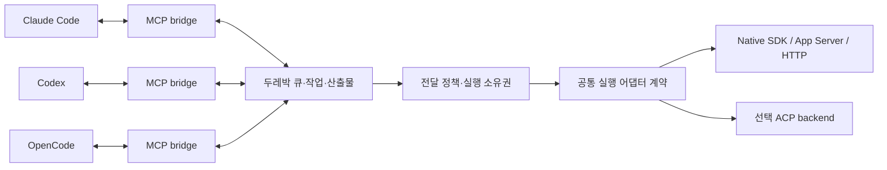

# 두레박 이종 세션 어댑터 설계

상태: 조사에 따른 제안, 런타임 미구현. 작성일: 2026-09-30.

[기존 제품 스펙](2026-09-29-durebak-design.md)의 cooperative/managed/attached, at-least-once 전달, 소유권 및 replay 원칙을 구체화한다. 기존 API를 이 문서만으로 변경하지 않는다. 근거와 대안은 [비교 조사](../../HETEROGENEOUS-AGENTS.md)를 따른다.

## 1. 목표와 수용 기준

같은 컴퓨터의 Claude Code·Codex·OpenCode 참여자가 서로 요청, 수신 확인, 검토, 수정된 산출물과 검증 근거를 교환한다. 도구 또는 모델을 바꾸어도 두레박 작업과 산출물의 식별자는 유지된다. 모델을 바꾸면 native 대화 상태도 이전된다고 보장하지 않는다.

세 도구의 서로 다른 6개 방향 모두 실제 호스트 시험이 있어야 ‘세 도구 간 검증 완료’로 표시한다. MCP SDK에 provider 문자열만 달리 붙인 시험은 protocol 시험이며 실제 호스트 시험을 대체하지 않는다. 인증 실패·미설치는 blocked/not-tested이고 성공이 아니다.

첫 범위는 로컬 text/artifact 협업이다. 원격 연결, 모든 CLI 자동 지원, 무제한 자동 개선 루프, 사용자 활성 세션 강제 인수는 범위 밖이다.

## 2. 혼동을 없애는 용어

| 구분 | 의미 | 예 |
| --- | --- | --- |
| host | 실제 실행 머신 | local machine ID |
| harness | 에이전트를 실행하는 도구 | claude-code, codex, opencode |
| backend | 두레박이 도구와 연결하는 실행 경로 | cooperative-mcp, codex-app-server, claude-agent-sdk, opencode-http, acpx-acp |
| modelProvider | 모델 추론을 제공하는 설정상의 서비스 | 실제 조회된 provider ID; 미확인이면 null |
| model | 제공자 내 모델 식별자 | 실제 조회된 ID; 사용자 요청값과 실행 확인값 별도 |
| participant/session | 두레박 참여 identity | 현재 인증된 session ID |
| nativeSession | 도구 내부 대화 identity | thread ID 또는 native session ID |
| attempt | 특정 작업의 한 번 실행 시도 | 두레박 attempt ID + native run/turn ID |

`OpenCode + provider A + model X`와 `OpenCode + provider B + model Y`는 같은 harness 어댑터를 사용하고 모델 profile만 다르다. 도구 이름으로 provider/model을 추정하지 않는다. `host`는 앞으로 머신만 뜻하며 현재 `setup --host` 옵션은 호환 별칭으로 취급한다.

## 3. 책임과 데이터 흐름

- **Runtime**: workspace 권한, 우선순위, batching, TTL, 중복 억제, 메시지·작업·결과의 기준 저장소.
- **Harness adapter**: 설정 파일, 설치 버전 탐지, 인증 상태, 실행 인자, 이벤트·오류 변환.
- **Execution backend**: native 세션 생성/연결/재개/관측/취소. 부재한 기능은 명시적 unsupported.
- **Model profile**: 관측된 모델·입력 형식·context 한도·usage 표현. 스케줄링이나 권한을 결정하지 않는다.
- **Skill/plugin**: 협업 절차와 연결 안내. 런타임 상태의 기준이나 필수 coordinator가 아니다.

특정 모델을 coordinator로 고정하지 않는다. 권한을 가진 어느 참여자든 같은 protocol로 요청·검토를 맡을 수 있다.

## 4. 두 단계 어댑터 계약

한 인터페이스에 모든 기능을 필수로 넣어 cooperative 지원을 거짓 구현하지 않는다.

### A. 연결 어댑터 — 첫 리팩터링

- `id`, `supportedVersions`, `renderMcpConfig(bridgeCommand, sessionPath)`
- `probe({scope, liveAuth:false})`: 설치, 버전, 로컬 인증 흔적, 접근 가능 여부를 분리해서 반환.
- `normalizeError(raw)`: 민감 문자열을 제거한 공통 오류 + 진단용 native code.

`probe`는 기본적으로 유료 모델 호출을 하지 않는다. `credentials_present`는 `live_auth_verified`가 아니다. live 인증 시험은 별도 명시적 실행이며 timestamp와 credential 변경에 따른 무효화를 기록한다.

### B. 실행 어댑터 — 후속 구현

- `start`, `attach`, `resume`: 의미가 다른 세 연산. 반환 binding에는 instance, native session, capability 근거가 필요.
- `submit(binding, attempt, input)` → accepted/rejected/unknown 및 확인된 native run ID.
- `observe(binding, cursor)` → 구조화된 이벤트/조회; 폴링은 런타임이 제한된 backoff로 수행.
- `cancel(binding, attempt)` → 취소 요청 여부. 종료 확인 전에는 cancelled로 확정하지 않음.
- `reconcile(binding, attempt)` → running/succeeded/failed/not_started/unknown.
- `close(binding)` → 두레박 소유 자원만 정리; 기존 사용자 세션 종료와 동일하지 않음.

공통 오류: `not_installed`, `unsupported_version`, `auth_required`, `auth_expired`, `rate_limited`, `permission_required`, `context_exceeded`, `unsupported_capability`, `session_busy`, `transport_lost`, `unknown_outcome`. 재시도 여부는 오류 문자열만으로 정하지 않고 제출 여부·부작용·attempt 상태를 함께 본다.

## 5. capability와 권한

`mcp_tools`, `managed_start`, `attach_existing`, `resume`, `structured_events`, `interrupt`, `steer`, `permission_bridge`, `usage`, `context_usage`를 기능별로 기록한다. 각 항목은 supported/unsupported/unknown, 근거 종류, 시험 버전과 날짜를 가진다.

실행 가능 여부 = 검증된 backend 기능 ∩ 세션의 실시간 상태 ∩ 사용자/작업 권한. 등록자가 capability=true를 주장하는 것으로 실행 권한을 얻지 못한다. 인증된 adapter handshake와 런타임 정책이 이를 확인한다. 모델별 기능도 요청값·확인값을 구분하며 미확인 기능은 비활성화한다.

`permission_required`는 오류 재시도가 아니라 승인을 기다리는 상태다. callback은 workspace/session/attempt/request ID에 결합하고, 만료·종료된 요청에 승인 답변을 재사용하지 않는다. 이종 호스트의 permission mode를 가장 느슨한 공통값으로 맞추지 않는다.

## 6. 큐와 실행 상태

기존 메시지 상태와 새로운 실행 상태를 분리한다. `ack`는 전달 수신 확인이며 작업 완료가 아니다.

실행 상태 제안: `queued → submitting → running → succeeded|failed|cancelled`, 중간에 `waiting_permission`, `waiting_auth`, `rate_limited`, `reconciling`, `unknown_outcome`을 둔다. 이후 전이와 명시적 운영자 결정을 event log에 기록한다. 기존 task의 pending/claimed/completed API를 즉시 이 enum으로 바꾸지 않는다.

- 기존 normal 5초/high 1초/low 30초 및 urgent 정책을 유지한다.
- queued 메시지는 우선순위 정책으로 선택한다. backend에는 활성 실행 한 개만 제출해 이중 큐를 최소화한다.
- urgent는 paused·승인·소유권을 우회하지 않는다. 실행 중단은 interrupt 지원과 별도 정책이 있어야 한다.
- 메시지 delivery lease 만료는 재전달 근거다. 실행 lease 만료는 이전 프로세스 종료의 증거가 아니다.
- 제출 전 상태와 dedup key를 저장한다. backend 접수 뒤 응답이 유실되면 `unknown_outcome`으로 reconcile한다. idempotent submit이 보장되지 않으면 blind retry하지 않는다.
- native/ACP/외부 터미널 backend가 같은 native session을 동시에 실행하지 못하도록 단일 owner와 epoch를 둔다. 외부 writer를 배제할 수 없는 attached 세션은 자동 submit을 허용하지 않는다.

대기는 모델의 반복 호출 대신 daemon timer/event/long-poll로 처리한다. 이는 후속 구현이며 현재 blocking wait 명령이 존재한다는 뜻이 아니다.

## 7. 이벤트와 완료 판정

공통 이벤트 필드: event ID, workspace, participant, attempt ID, native session/run ID(알 수 없으면 null), origin(live/replay/audit), backend cursor(있으면), 관측시각, adapter version, sanitized payload.

`submit.accepted`, `run.started`, `output.delta`, `tool.started`, `tool.finished`, `approval.requested`, `usage.updated`, `run.finished`, `run.failed`, `connection.lost` 등을 정규화한다. backend에 없는 사실을 합성해 성공으로 만들지 않는다. 원문 전체 transcript는 기본 저장하지 않는다.

`idle`, 프로세스 exit 0, 마지막 문장의 ‘완료’만으로 작업 성공을 확정하지 않는다. 현재 owner/attempt와 결과 artifact hash, acceptance 검증을 대조한다. 늦게 도착한 이전 attempt의 완료는 감사 기록만 남기며 최신 작업을 덮어쓰지 않는다. replay 이벤트는 과거 복구 확인에만 사용하고 새 요청·후속 실행을 만들지 않는다.

## 8. 모델 차이와 토큰/캐시

모델 차이는 필요한 범위에서 profile로 표현한다. 처음부터 모델별 실행 어댑터를 늘리지 않는다. native backend가 모델 기능·usage를 보고하면 출처와 함께 저장하고, 모르면 null로 남긴다.

- Native session의 resume와 provider prompt cache는 별개다. 한 도구의 세션/캐시를 다른 도구에서 재사용한다고 주장하지 않는다.
- 공유하는 것은 목적, 제약, 결정, 미완료 항목, artifact hash와 필요한 범위다. 전체 transcript를 매번 복사하지 않는다.
- 파생 cache key는 workspace 권한 경계, artifact hash, 변환 schema/prompt version, model profile에 의존하는 경우 그 ID를 포함한다.
- usage는 input/output/cached/reasoning 토큰을 각 제공자의 의미와 함께 보존한다. 누락은 0이 아니다. 누적/증분도 구분하고 같은 event를 중복 합산하지 않는다.
- 요청 모델과 실제 모델이 다르면 기록하고 정책에 따라 중지한다. 인증 실패 때 다른 계정·모델로 자동 전환하지 않는다.

## 9. 기존 사용자 호환성과 모듈 경계

1. `src/harnesses/`에 설정 생성 registry와 공통 타입을 옮긴다. 기존 setup 출력은 snapshot이 아니라 실제 parser/연결 시험으로 유지한다.
2. `scripts/lib/host-adapters/`에 실험용 launch/event parser를 분리하고 `host-lab`은 조합과 검증만 담당한다. 제품 실행 어댑터와 시험 helper를 혼동하지 않는다.
3. 새 API에 `harness`를 도입한다. 기존 `--provider claude`/DB provider는 deprecated harness 별칭으로 읽고, 새 `modelProvider`로 자동 변환하지 않는다. 둘을 함께 주고 충돌하면 거절한다. `setup --host`도 새 `--harness`와 충돌 검사한다.
4. native binding/attempt/event/owner는 별도 migration으로 추가한다. 기존 session ID·credential·message cursor·artifact hash는 보존한다. 새 열/테이블 도입 전에 구버전 읽기/롤백 범위를 명시한다.
5. 인증정보는 private 파일에 유지한다. 공유 profile/공개 보고서에는 credential 원문·개인 경로를 넣지 않는다.

이 문서에서 코드/DB/API 변경을 수행한 것은 아니다. 기존 제품 스펙에서 도구를 뜻하는 Provider는 이 제안의 harness에 해당한다.

## 10. 검증 매트릭스와 구현 순서

### 필수 이종 시험

| 요청자 | 검토자 | 결과가 돌아올 곳 |
| --- | --- | --- |
| Codex | Claude Code | 같은 두레박 Codex identity |
| Claude Code | Codex | 같은 두레박 Claude identity |
| Codex | OpenCode | 같은 두레박 Codex identity |
| OpenCode | Codex | 같은 두레박 OpenCode identity |
| Claude Code | OpenCode | 같은 두레박 Claude identity |
| OpenCode | Claude Code | 같은 두레박 OpenCode identity |

각 조합: 독립 credential, 실제 host/version/backend/model 근거, correlated request/reply, receipt ack, owner claim, 검토 후 수정 artifact, latest revision 검증을 기록한다. 동일한 native 대화 재개는 별도 항목이며 두레박 identity 재사용으로 대체하지 않는다.

### 장애 계약 시험

인증 만료, rate limit, approval 대기, busy/paused urgent, 이전 attempt 결과, 재개 replay, native/ACP 소유권 경쟁, submit 접수 후 연결 단절, cancel 후 종료 미확인, 모델 변경, usage 누락/중복, 독립 workspace 접근을 검증한다. 모의 protocol 시험과 유료 실제 모델 시험 보고서를 구분한다.

### 작은 단계

- P0: harness/backend/modelProvider 용어와 설정 registry 정리. 현재 동작 유지와 호환 별칭 테스트.
- P1: live lab의 worker/reviewer 선택을 대칭화하고 세 도구 adapter를 분리. 6개 이종 조합 시험; 막힌 조합은 원인 표시.
- P2: native/ACP 각 한 조합으로 ownership·submit/reconcile·approval·cancel을 비교한 뒤 managed backend 선택.
- P3: 장기 대기/깨우기, 실행 복구와 bounded review loop. backoff·한도·중단을 먼저 검증.

2026-09-30 현재 Codex↔Codex cooperative 실연동만 통과했다. 재시도한 Codex→Claude 시험은 송신 후 Claude 인증 실패로 중단됐고, OpenCode는 미설치다. 공식 문서가 기능을 설명하더라도 로컬 지원 검증표를 자동 승격하지 않는다.
